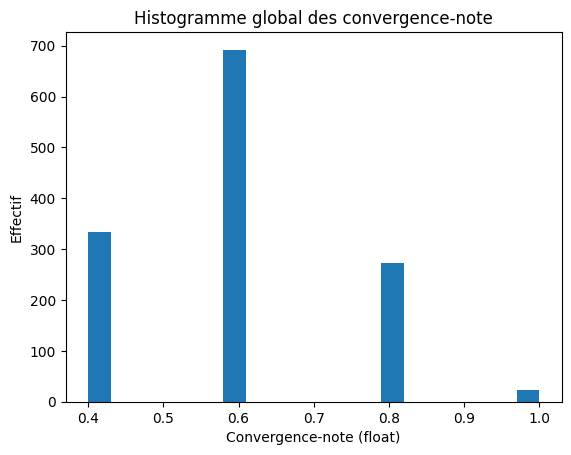
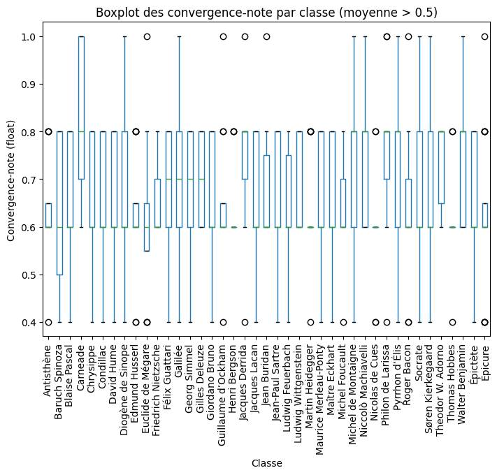

# Pseudoluc-philo-occidentale

Analyse de la convergence entre les idées de la philosophie occidentale et un clone de personnalité

* Lionel JOUFFE (Bayesia), Hierarchical Network of Philosophers and Their Ideas, https://www.linkedin.com/pulse/hierarchical-network-philosophers-ideas-lionel-jouffe-3re3e/
* Luc E. BRUNET. Le problème difficile de l’identité : évaluation d’un clone LLM. *JITIPEE* **9**, (2025), 10.52497/jitipee.v9i2.381.

# Objectif

Dans ce projet, l'idée est de faire explorer les topics de la philosophie occidentale par un clone de personnalité capable de déterminer la convergence de chaque idée avec ses valeurs.

# Analyse des classes vs. convergence-note

## 1. Statistiques descriptives globales

- **Nombre** : 1321
- **Moyenne** : 0.60
- **Médiane** : 0.60
- **Écart-type** : 0.15
- **Min** : 0.40
- **Max** : 1.00

## 2. Distribution globale

## 3. Statistiques par classe (triées)

| classes                            |   Nombre |   Moyenne |   Médiane |   Écart-type |   Min |   Max |
|:-----------------------------------|---------:|----------:|----------:|-------------:|------:|------:|
| Carneade                           |       11 |      0.84 |      0.80 |         0.17 |  0.60 |  1.00 |
| Philon de Larissa                  |       11 |      0.76 |      0.80 |         0.17 |  0.40 |  1.00 |
| Jacques Derrida                    |       15 |      0.75 |      0.80 |         0.14 |  0.40 |  1.00 |
| Pyrrhon d’Élis                     |       14 |      0.74 |      0.80 |         0.18 |  0.40 |  1.00 |
| Theodor W. Adorno                  |       10 |      0.74 |      0.80 |         0.10 |  0.60 |  0.80 |
| Niccolò Machiavelli                |       12 |      0.73 |      0.80 |         0.13 |  0.60 |  1.00 |
| Walter Benjamin                    |       11 |      0.73 |      0.80 |         0.13 |  0.60 |  1.00 |
| Galilée                            |       12 |      0.70 |      0.70 |         0.16 |  0.40 |  1.00 |
| Jean Buridan                       |        6 |      0.70 |      0.60 |         0.17 |  0.60 |  1.00 |
| Michel de Montaigne                |       16 |      0.70 |      0.80 |         0.16 |  0.40 |  1.00 |
| Gilles Deleuze                     |       16 |      0.70 |      0.70 |         0.10 |  0.60 |  0.80 |
| Ludwig Wittgenstein                |       14 |      0.69 |      0.60 |         0.10 |  0.60 |  0.80 |
| Diogène de Sinope                  |       11 |      0.67 |      0.60 |         0.18 |  0.40 |  1.00 |
| Socrate                            |       12 |      0.67 |      0.60 |         0.18 |  0.40 |  1.00 |
| Jacques Lacan                      |       15 |      0.67 |      0.60 |         0.12 |  0.40 |  0.80 |
| Félix Guattari                     |       16 |      0.66 |      0.70 |         0.16 |  0.40 |  0.80 |
| Georg Simmel                       |       16 |      0.66 |      0.70 |         0.16 |  0.40 |  0.80 |
| Søren Kierkegaard                  |       16 |      0.66 |      0.60 |         0.14 |  0.40 |  1.00 |
| Condillac                          |       14 |      0.66 |      0.60 |         0.12 |  0.40 |  0.80 |
| Épictète                           |       14 |      0.66 |      0.60 |         0.15 |  0.40 |  0.80 |
| Giordano Bruno                     |       14 |      0.66 |      0.60 |         0.12 |  0.40 |  0.80 |
| Friedrich Nietzsche                |       15 |      0.65 |      0.60 |         0.09 |  0.60 |  0.80 |
| Blaise Pascal                      |       16 |      0.65 |      0.60 |         0.14 |  0.40 |  0.80 |
| Guillaume d’Ockham                 |       12 |      0.65 |      0.60 |         0.15 |  0.40 |  1.00 |
| Maurice Merleau-Ponty              |       13 |      0.65 |      0.60 |         0.12 |  0.40 |  0.80 |
| Henri Bergson                      |       13 |      0.65 |      0.60 |         0.09 |  0.60 |  0.80 |
| Chrysippe                          |       14 |      0.64 |      0.60 |         0.14 |  0.40 |  0.80 |
| Michel Foucault                    |       15 |      0.64 |      0.60 |         0.11 |  0.40 |  0.80 |
| Jean-Paul Sartre                   |       15 |      0.64 |      0.60 |         0.14 |  0.40 |  0.80 |
| Roger Bacon                        |       11 |      0.64 |      0.60 |         0.17 |  0.40 |  1.00 |
| Maître Eckhart                     |       12 |      0.63 |      0.60 |         0.14 |  0.40 |  0.80 |
| David Hume                         |       18 |      0.63 |      0.60 |         0.14 |  0.40 |  0.80 |
| Antisthène                         |       12 |      0.63 |      0.60 |         0.12 |  0.40 |  0.80 |
| Martin Heidegger                   |       19 |      0.63 |      0.60 |         0.10 |  0.40 |  0.80 |
| Edmund Husserl                     |       16 |      0.62 |      0.60 |         0.12 |  0.40 |  0.80 |
| Ludwig Feuerbach                   |       10 |      0.62 |      0.60 |         0.15 |  0.40 |  0.80 |
| Épicure                            |       20 |      0.62 |      0.60 |         0.16 |  0.40 |  1.00 |
| Euclide de Mégare                  |       12 |      0.62 |      0.60 |         0.18 |  0.40 |  1.00 |
| Thomas Hobbes                      |       13 |      0.62 |      0.60 |         0.10 |  0.40 |  0.80 |
| Baruch Spinoza                     |       15 |      0.61 |      0.60 |         0.16 |  0.40 |  0.80 |
| Nicolas de Cues                    |        9 |      0.60 |      0.60 |         0.14 |  0.40 |  0.80 |
| Francis Bacon                      |       14 |      0.60 |      0.60 |         0.14 |  0.40 |  0.80 |
| Denis Diderot                      |       12 |      0.60 |      0.60 |         0.15 |  0.40 |  0.80 |
| Sénèque                            |       16 |      0.60 |      0.60 |         0.13 |  0.40 |  0.80 |
| Paul Ricœur                        |       12 |      0.60 |      0.60 |         0.09 |  0.40 |  0.80 |
| Voltaire                           |       12 |      0.60 |      0.60 |         0.12 |  0.40 |  0.80 |
| Max Weber                          |       17 |      0.59 |      0.60 |         0.15 |  0.40 |  1.00 |
| Platon                             |       16 |      0.59 |      0.60 |         0.14 |  0.40 |  0.80 |
| Simone de Beauvoir                 |       13 |      0.58 |      0.60 |         0.13 |  0.40 |  0.80 |
| Karl Jaspers                       |       13 |      0.58 |      0.60 |         0.15 |  0.40 |  0.80 |
| Aristippe de Cyrène                |       12 |      0.58 |      0.60 |         0.16 |  0.40 |  0.80 |
| George Berkeley                    |       12 |      0.58 |      0.60 |         0.13 |  0.40 |  0.80 |
| Arthur Schopenhauer                |       12 |      0.58 |      0.60 |         0.13 |  0.40 |  0.80 |
| Jacques-Pierre Brissot             |       12 |      0.58 |      0.60 |         0.13 |  0.40 |  0.80 |
| Emmanuel Levinas                   |       12 |      0.58 |      0.60 |         0.10 |  0.40 |  0.80 |
| John Stuart Mill                   |       11 |      0.58 |      0.60 |         0.14 |  0.40 |  0.80 |
| Montesquieu                        |       11 |      0.58 |      0.60 |         0.11 |  0.40 |  0.80 |
| Max Horkheimer                     |       10 |      0.58 |      0.60 |         0.15 |  0.40 |  0.80 |
| Érasme de Rotterdam                |       10 |      0.58 |      0.60 |         0.15 |  0.40 |  0.80 |
| Al-Ghazâlî                         |       15 |      0.57 |      0.60 |         0.10 |  0.40 |  0.80 |
| Porphyre                           |       13 |      0.57 |      0.60 |         0.11 |  0.40 |  0.80 |
| Georg Wilhelm Friedrich Hegel      |       12 |      0.57 |      0.60 |         0.14 |  0.40 |  0.80 |
| Claude Lévi-Strauss                |       12 |      0.57 |      0.60 |         0.12 |  0.40 |  0.80 |
| Herbert Spencer                    |       12 |      0.57 |      0.60 |         0.12 |  0.40 |  0.80 |
| Maimonide                          |       14 |      0.56 |      0.60 |         0.12 |  0.40 |  0.80 |
| Proclus                            |       14 |      0.56 |      0.60 |         0.12 |  0.40 |  0.80 |
| Malebranche                        |        9 |      0.56 |      0.60 |         0.17 |  0.40 |  0.80 |
| Karl Marx                          |       13 |      0.55 |      0.60 |         0.12 |  0.40 |  0.80 |
| Jürgen Habermas                    |       13 |      0.55 |      0.60 |         0.15 |  0.40 |  0.80 |
| Aristote                           |       21 |      0.55 |      0.60 |         0.11 |  0.40 |  0.80 |
| Zénon de Cition                    |       16 |      0.55 |      0.60 |         0.09 |  0.40 |  0.60 |
| Sigmund Freud                      |       16 |      0.55 |      0.60 |         0.12 |  0.40 |  0.80 |
| Duns Scot                          |       12 |      0.55 |      0.60 |         0.15 |  0.40 |  0.80 |
| Plotin                             |       11 |      0.55 |      0.60 |         0.13 |  0.40 |  0.80 |
| Condorcet                          |       11 |      0.55 |      0.60 |         0.13 |  0.40 |  0.80 |
| Averroès (Ibn Rushd)               |       11 |      0.55 |      0.60 |         0.13 |  0.40 |  0.80 |
| Avicenne (Ibn Sina)                |       13 |      0.54 |      0.60 |         0.15 |  0.40 |  0.80 |
| Johann Gottlieb Fichte             |       13 |      0.54 |      0.60 |         0.10 |  0.40 |  0.60 |
| Leibniz                            |       16 |      0.54 |      0.60 |         0.12 |  0.40 |  0.80 |
| Xénophon                           |       12 |      0.53 |      0.50 |         0.16 |  0.40 |  0.80 |
| John Locke                         |       17 |      0.53 |      0.60 |         0.14 |  0.40 |  0.80 |
| Boèce                              |       14 |      0.53 |      0.60 |         0.13 |  0.40 |  0.80 |
| Adam Smith                         |       14 |      0.53 |      0.60 |         0.13 |  0.40 |  0.80 |
| Friedrich Wilhelm Joseph Schelling |       14 |      0.53 |      0.60 |         0.10 |  0.40 |  0.60 |
| Al-Fārābī                          |       14 |      0.53 |      0.60 |         0.10 |  0.40 |  0.60 |
| Jean Scot Érigène                  |       16 |      0.53 |      0.50 |         0.14 |  0.40 |  0.80 |
| Cléanthe                           |       13 |      0.52 |      0.60 |         0.13 |  0.40 |  0.80 |
| Emile Durkheim                     |       15 |      0.52 |      0.60 |         0.13 |  0.40 |  0.80 |
| René Descartes                     |       17 |      0.52 |      0.60 |         0.12 |  0.40 |  0.80 |
| Thomas d’Aquin                     |       12 |      0.52 |      0.50 |         0.13 |  0.40 |  0.80 |
| Jean-Jacques Rousseau              |       14 |      0.51 |      0.40 |         0.15 |  0.40 |  0.80 |
| Emmanuel Kant                      |       16 |      0.51 |      0.50 |         0.13 |  0.40 |  0.80 |
| Marc Aurèle                        |        9 |      0.51 |      0.40 |         0.15 |  0.40 |  0.80 |
| Giovanni Pico della Mirandola      |       12 |      0.50 |      0.50 |         0.10 |  0.40 |  0.60 |
| Mendelssohn                        |       12 |      0.50 |      0.40 |         0.13 |  0.40 |  0.80 |
| Cicéron                            |       18 |      0.49 |      0.40 |         0.10 |  0.40 |  0.60 |
| Thomas More                        |       10 |      0.48 |      0.40 |         0.10 |  0.40 |  0.60 |
| Tommaso Campanella                 |       11 |      0.47 |      0.40 |         0.10 |  0.40 |  0.60 |
| Auguste Comte                      |       11 |      0.44 |      0.40 |         0.08 |  0.40 |  0.60 |

## 4. Visualisation par classe (moyenne > 0.6)

